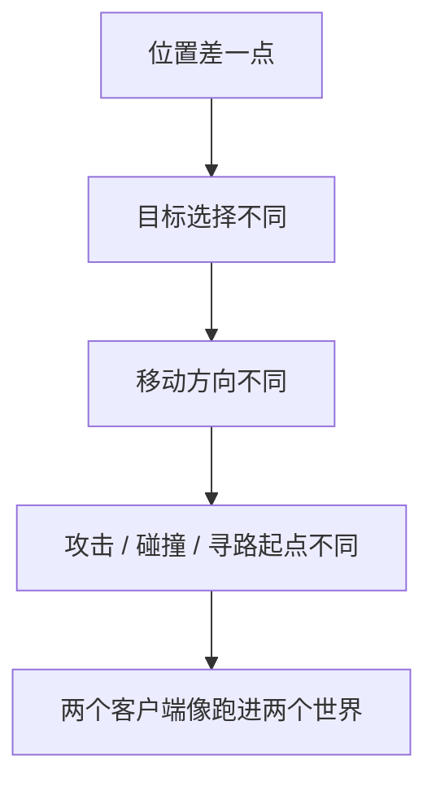
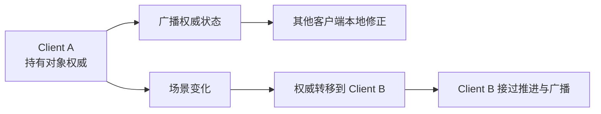
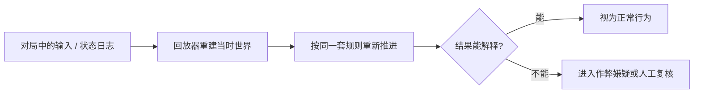

---
layout: cover
---

<h1>多人同步技术分享</h1>

今天我们来破一个案子  
为什么两边看着一模一样  
最后却不是同一个世界

  时长：60 分钟

---
layout: center
class: text-center
---

  

---
layout: statement
---

<h1>画面同步</h1>

不代表

<h1>底层数据一致</h1>

肉眼看到的是画面。 
网络同步真正关心的，是同一时刻两端底层数据是否一致。

---
layout: default
---

<h1>一个看起来完全同步的项目</h1>

<h3>你盯着画面看，会得到这个结论</h3>

- 两个玩家站在同一个平台上
- 位置对得上
- 动作对得上
- 整个世界看起来已经很稳

<h3>但我真正不放心的是另一层</h3>

- 这只是画面同步
- 不代表底层数据真的一致
- 误差可能已经发生
- 只是还没穿透到表现层

所以我当时想的不是“现在像不像同步”，而是“我怎么证明它真的同步”。

---
layout: default
---

<h1>接入检测工具之后，世界突然换了一张脸</h1>

  

    <h3>开始前</h3>
    
肉眼看完全同步，没人会觉得这里有大问题。

  

  

    <h3>两分钟后</h3>
    
不同步错误日志开始大量出现，而且不是偶发，是持续冒出来。

  

  

    <h3>这意味着</h3>
    
它不是没有不同步，只是不同步还小到肉眼看不出来。

  

当画面看起来同步的时候，你怎么证明底层状态真的同步？

---
layout: section
---

<h1>不同步是怎么被看见的</h1>

---
layout: default
---

<h1>先别看画面，先看状态</h1>

  
盯屏幕：只能看结果

  
接检测：开始看状态

  
做定位：找到异常源头

  
做解释：再谈为什么雪崩

<h3>先抓住这一点</h3>

- 两个角色站对位置、动作对得上，只能说明表现层暂时没穿帮
- 网络同步真正发生的地方，不在画面，而在底层状态
- 所以表现没穿帮，不等于状态没问题

画面只是结果，状态才是同步真正发生的地方。

---
layout: default
---

<h1>检测工具的价值，不是修复，而是证明</h1>

<h3>它不做什么</h3>

- 它不会让世界自动变同步
- 它不会直接修掉 bug
- 它不会替你完成架构设计

<h3>它真正提供什么</h3>

- 把“我感觉没问题”变成“我知道哪里有问题”
- 让同步问题从表现层进入状态层
- 让排查从猜测变成可证明

企业级工程不能靠盯屏幕判断同步状态。

---
layout: default
---

<h1>真正落地时，检测的不是“像不像”，而是状态指纹</h1>

<h3>第一级：先做粗检测</h3>

- 每一帧把当前游戏逻辑数据整体算一次 `hashCode`
- 得到一个 `int` 值，随帧号一起上报到服务器
- 服务器只先比较这一帧两边的摘要值是不是一致

<h3>它解决什么问题</h3>

- 不先定位是谁错了
- 先钉死“从哪一帧开始，世界已经分叉”
- 这样服务器能第一时间发现不同步，并通知所有客户端

这一级不负责解释原因，只负责尽快发现“哪一帧已经不是同一个世界”。

---
layout: default
---

<h1>发现不同步之后，再做第二级精检测</h1>

  

    <h3>服务器先通知</h3>
    
一旦发现某一帧 `hashCode` 不一致，服务器就推消息告诉所有客户端：哪一帧不同步了。

  

  

    <h3>客户端再补数据</h3>
    
每个客户端从本地取出不同步点附近最近两帧的逻辑缓存，再把完整数据上报到服务器。

  

  

    <h3>服务器做字段级比对</h3>
    
最后比出来的不是“有问题”，而是哪个角色或哪个道具的哪个属性先不同步了。

  

所以检测真正做的是两层事：第一层先抓到分叉帧，第二层再把分叉点拆到对象和属性。

---
layout: default
---

<h1>为什么这个项目能骗过肉眼？</h1>

<h3>已经被约束的部分</h3>

- 核心战斗逻辑用了定点数
- 和 `float` 相关的东西做了预计算或定点数化
- 玩家位置和平台关系看起来都很稳

<h3>真正漏出去的部分</h3>

- 一部分逻辑是动画驱动的
- 动画背后仍然依赖 Unity `float`
- 一条没被约束的支路，就足够让状态开始分叉

---
layout: default
---

<h1>最麻烦的不是“全都错了”，而是“只漏了一条支路”</h1>

<h3>它为什么特别容易藏住</h3>

- 大部分核心逻辑已经被定点数化，所以主流程看起来很稳
- 只有少量分支还挂在动画、浮点或引擎时序上
- 它不会一开局就炸，而是先藏成一丝很小的偏差
- 正因为前面 95% 都是对的，剩下那 5% 才更容易骗过人

同步工程里最危险的 bug，常常不是大面积失控，而是“只有一小块还没被纳入规则”。

---
layout: default
---

<h1>先看见不同步，后面才谈得上解决</h1>

<h3>真实项目更常卡在这里</h3>

- 很多人讨论同步，第一反应是“怎么修”
- 但真实项目经常先卡在更前面：你根本不知道它已经不同步
- 看不见不同步，就谈不上解释不同步，更谈不上解决不同步

为什么一开始只是很小的一点差异，最后会变成整个世界对不上？

---
layout: section
---

<h1>雪崩：帧同步为什么这么难扛</h1>

---
layout: default
---

<h1>帧同步真正难的，不是“操作一样”</h1>

<h3>真正苛刻的地方</h3>

- 帧同步听起来像“大家拿同样操作，各自跑逻辑”
- 真正难的是每一帧跑完以后，状态还必须一致
- 只要某一帧偏了，下一帧就不是从同一个世界继续往下算

---
layout: default
---

<h1>MOBA 案例：项目从一开始就站在危险地面上</h1>

  

    <h3>项目形态</h3>
    
手机射击 MOBA，双线对战，有小兵、敌人和防御塔。

  

  

    <h3>同步路线</h3>
    
硬上帧同步，让客户端自己跑结果。

  

  

    <h3>底层依赖</h3>
    
Unity `float`、物理和寻路直接参与逻辑。

  

这些东西不是不能用，而是不适合直接承担“所有客户端每帧结果完全一致”这个要求。

---
layout: default
---

<h1>分叉往往不是从大故障开始，而是一个普通判断</h1>

<h3>一个具体场景</h3>

- 一个小兵要判断自己该往左边防御塔走，还是往右边防御塔走
- 如果两个客户端里小兵的位置有极小差异，最近防御塔就可能不同
- A 客户端往左，B 客户端往右，状态从这一刻开始分叉

---
layout: default
---

<h1>真正的雪崩，是每一帧都在错误起点上继续</h1>

<h3>雪崩链条</h3>

- 位置差一点，朝向就可能差一点
- 朝向差一点，下一帧移动、寻路、攻击检测、碰撞计算起点就都不一样
- 后续每一帧都在不同状态上继续计算，误差只会越来越大
- 最后看到的不是某个数不一样，而是整个世界对不上

画面明显不同步时，通常已经晚了。真正难排的是第一块滑下来的石头。

---
layout: default
---

<h1>所以帧同步的工程压力，本质上是确定性工程</h1>

<h3>新人容易以为难点在</h3>

- 网络收发
- 操作同步
- 延迟处理

<h3>真实项目里更难的是</h3>

- 物理
- 寻路
- 动画
- 随机
- 战斗系统

既然让每台客户端、每一帧都算出完全一样这么难，能不能干脆别让客户端决定结果？

---
layout: section
---

<h1>状态同步是不是答案？</h1>

---
layout: default
---

<h1>很自然的直觉：那就让服务器来算</h1>

  

    <h3>帧同步</h3>
    <ul>
      <li>客户端自己算</li>
      <li>要求每帧严格一致</li>
      <li>复杂度压在确定性上</li>
    </ul>
  

  

    <h3>状态同步</h3>
    <ul>
      <li>重要结果由服务器决定</li>
      <li>客户端接收结果并拉回</li>
      <li>复杂度压在服务器模拟上</li>
    </ul>
  

---
layout: default
---

<h1>它确实绕开了一部分帧同步的压力</h1>

<h3>状态同步带来的缓解</h3>

- 不再要求每个客户端完整、严格地跑出同一个世界
- 客户端即使有预测、插值、延迟修正，最终也可以被服务器状态拉回来
- 所以它确实绕开了一部分“所有端每帧绝对一致”的压力

听上去像答案，但复杂度并没有消失。

---
layout: default
---

<h1>代价是：服务器要理解并运行足够完整的世界</h1>

<h3>服务器不只是转发器</h3>

- 如果游戏里有物理、碰撞、AI、战斗、道具、载具等逻辑，服务器就要判断这些结果是否成立
- 这意味着服务器要跑一套接近客户端的游戏逻辑
- 在含物理的项目里，甚至要实时跑一套和客户端一致的物理系统

---
layout: default
---

<h1>走到这里，两条常见路线都不便宜</h1>

| 路线 | 核心收益 | 核心代价 |
| --- | --- | --- |
| 帧同步 | 不需要服务器跑完整世界 | 确定性工程极重，排查像下地狱 |
| 状态同步 | 服务端可以做权威裁决 | 服务器容易被做成另一个客户端 |

如果我们既不想把复杂度全压到客户端确定性上，也不想把服务器做成另一个客户端，还有没有第三种分配方式？

---
layout: section
---

<h1>拟真驱动 + 分布式权威</h1>

---
layout: default
---

<h1>自研框架的一句话定义</h1>

> 拟真驱动整个世界每一帧运行，再以状态同步的方式做权威修正。

<h3>这句话前半段</h3>

- 世界不是完全靠服务器实时推着走
- 每个客户端都在本地拟真运行

<h3>这句话后半段</h3>

- 一旦出现偏差，不放任它漂
- 用权威状态把它拉回轨道

---
layout: default
---

<h1>拟真驱动：继续让本地世界跑起来，但不承诺绝对一致</h1>

<h3>它和严格帧同步最大的不同</h3>

- 客户端仍然按同一套规则推进世界
- 规则、输入、初始状态接近时，结果大概率会一致或接近
- 但它不把“所有客户端每一帧必须完全一致”当作绝对前提

它承认偏差可能发生，因此不再把全部工程压力压到“每一帧绝对一致”上。

---
layout: default
---

<h1>权威修正：允许偏差发生，但不允许偏差无限扩大</h1>

<h3>它不要求的事情</h3>

- 能不能永远没有偏差

<h3>它必须做到的事情</h3>

- 偏差能不能被看见
- 偏差能不能被修正
- 偏差能不能收敛

---
layout: default
---

<h1>修正也不是一句“拉回去”，而是要决定怎么拉</h1>

  

    <h3>硬修正</h3>
    <ul>
      <li>直接覆盖到权威状态</li>
      <li>好处是收敛快</li>
      <li>问题是观感可能突兀</li>
    </ul>
  

  

    <h3>软修正</h3>
    <ul>
      <li>用插值、平滑逐步贴近</li>
      <li>好处是画面自然</li>
      <li>问题是收敛更慢，要防止越修越漂</li>
    </ul>
  

所以“修正”本身也是设计题：你在收敛速度和表现稳定之间怎么取舍。

---
layout: default
---

<h1>真项目里，通常不是所有字段都用同一种修正策略</h1>

<h3>更实际的处理方式</h3>

- 位置、旋转这类高频连续量，常常做平滑修正
- 血量、Buff、命中结果这类离散结论，常常直接以权威值覆盖
- 目标选择、状态机阶段这类会影响后续分支的字段，要优先收敛

如果会改变后续逻辑分支的字段收敛太慢，小偏差还是会继续长成大偏差。

---
layout: default
---

<h1>分布式权威：不是很多服务器，而是权威分散在对象上</h1>

<h3>这里最容易被误解</h3>

- “分布式”不是指有很多服务器
- 它指的是权威不集中在一个中心服务器上
- 权威分散到各个客户端和对象上

<h3>最容易理解的一层</h3>

- 每个玩家是自己某些状态的权威
- 自己的位置、朝向、部分状态由自己负责广播给别人
- 其他客户端收到这些权威状态后，修正自己本地看到的世界

---
layout: default
---

<h1>玩家之外的实体，也需要自己的持有者</h1>

<h3>哪些对象也需要权威</h3>

- AI
- 车
- 道具
- 其他可交互实体

<h3>持有者负责什么</h3>

- 推进这个对象的权威状态
- 向其他端广播这个状态
- 让其他端据此做本地修正

---
layout: default
---

<h1>权威不是永久固定的，它可以像接力棒一样流动</h1>

<h3>真正关键的是</h3>

- 对象的权威不是永远固定在一个客户端
- 根据场景和规则，持有者可以发生转移
- 复杂度因此被放进了权威归属和权威转移规则里

---
layout: default
---

<h1>真正难写的，不是“能不能转移”，而是“什么时候转移”</h1>

<h3>权威切换常见触发条件</h3>

- 谁离这个对象最近，谁更适合持有
- 谁先与它发生交互，谁接过后续推进
- 原持有者离开战场、掉线或性能异常时，权威必须转交

<h3>最怕的情况</h3>

- 同一时刻两个人都觉得“现在该我管”
- 或者所有人都觉得“现在不是我管”

权威转移最怕的不是慢，而是归属不清。一旦归属模糊，同步问题会直接变成规则问题。

---
layout: default
---

<h1>所谓“第三种路线”，本质上是重新分配复杂度</h1>

<h3>三种思路的差别</h3>

- 严格帧同步追求的是“永不出错”
- 中心状态同步追求的是“中心实时裁决”
- 这套框架追求的是“允许偏差发生，但偏差必须可控”

它没有让复杂度消失，只是没有把复杂度全压到客户端确定性，也没有全压到服务器模拟。

---
layout: default
---

<h1>这时候大家最关心的问题：PvP 怎么防作弊？</h1>

  

    <h3>先承认风险</h3>
    
客户端权威确实意味着玩家可能篡改自己的数据。

  

  

    <h3>核心答案</h3>
    
行为要留下拟真数据，嫌疑状态要能被回放和规则解释。

  

  

    <h3>关键态度</h3>
    
不是无条件相信客户端，而是让异常无处可藏。

  

---
layout: default
---

<h1>防作弊不是一句“相信客户端”，而是成本分级</h1>

<h3>处理方式要分层</h3>

- 普通情况：对局结束后异步抽样回放
- 高风险情况：对被举报、异常频繁的玩家提高回放频率
- 严重情况：用专门的防作弊服务器实时跑整个模拟

别人想的是怎么让坏事不发生；这套框架更关心的是，坏事发生后能不能无处可藏。

---
layout: default
---

<h1>所谓“可回放”，本质上是把行为重新解释一遍</h1>

<h3>为什么这一步不能省</h3>

- 你不能只看“这个人数据怪不怪”
- 还要看“这些结果能不能被规则推出来”
- 能解释，就尽量别误伤；解释不了，才有惩罚依据

---
layout: default
---

<h1>前面的问题，其实都能串到同一条主线上</h1>

<h3>三个关键问题的答案</h3>

- 画面看起来同步不够，状态要能被检测
- 状态发生偏差不可怕，偏差要能被修正
- 客户端有权威不可怕，行为要能被回放

企业级同步框架真正管理的不是“同步”两个字，而是复杂度、偏差和信任。

---
layout: section
---

<h1>框架的价值，是重新分配复杂度</h1>

---
layout: default
---

<h1>画面同步，不代表底层数据一致</h1>

<h3>它真正证明了什么</h3>

- 肉眼完全同步的项目，接入检测工具后，两分钟开始出现大量不同步日志
- 这证明的不是某个项目有 bug，而是一个更普遍的事实
- 画面看起来没问题，不代表底层状态真的一致

所以企业级同步框架的第一件事，不是宣称自己不会不同步，而是要有能力发现不同步。

---
layout: default
---

<h1>以后再看一个同步方案，不要只问它叫什么</h1>

  
1. 它怎么看见不同步？

  
2. 它怎么处理偏差？

  
3. 它把复杂度放在哪里？

  
4. 它怎么管理客户端信任？

<h3>真正值得追问的是这四件事</h3>

- 不要只问它是帧同步还是状态同步
- 要看它是否具备发现、修正、追溯、解释问题的能力

---
layout: default
---

<h1>成熟方案，不是在追求最漂亮的理论模型</h1>

<h3>真正的判断标准</h3>

- 帧同步把复杂度压在客户端确定性上
- 状态同步把复杂度压在服务器模拟上
- 自研框架选择的是另一种分配方式：拟真驱动本地世界，分布式权威负责修正
- 客户端权威不是相信玩家不会改数据，而是要求行为能被规则解释、能被回放审计

---
layout: statement
---

<h1>一个成熟的同步框架</h1>

不是承诺世界永远不会偏  
而是当世界开始偏的时候  
能第一时间看见它、拉回它、解释它

---
layout: center
class: text-center
---

<h1>Q&A</h1>

谢谢

  关键词：偏差 / 复杂度 / 信任

