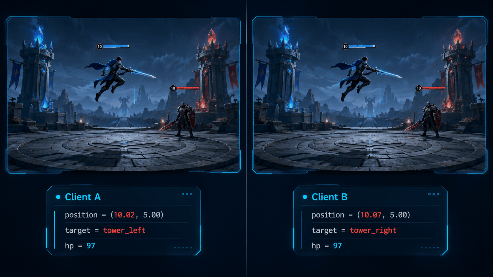
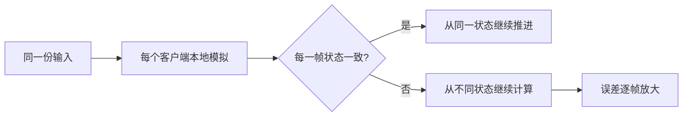
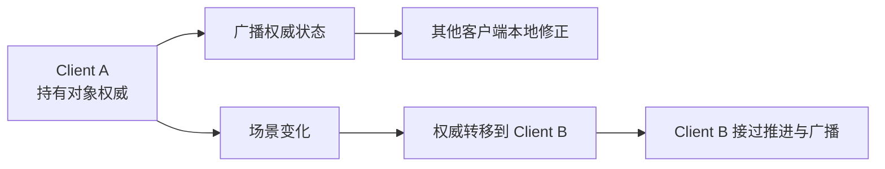
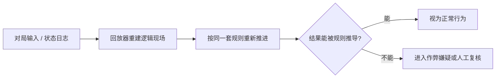

---
layout: cover
---

<h1>多人同步技术分享</h1>

今天我们来破一个案子  
为什么两边看着一模一样  
最后却不是同一个世界

  时长：60 分钟

---
layout: center
class: text-center
clicks: 1
---

  

    
    

    

  

---
layout: statement
---

<h1>表现同步</h1>

不代表

<h1>逻辑状态一致</h1>

---
layout: default
---

<h1>表现层一致，不等于逻辑层一致</h1>

<h3>表现层能看到的是</h3>

- 两个玩家处在同一平台区域
- 角色位置表现对齐
- 动作状态表现对齐
- 场景交互没有明显异常

<h3>逻辑层必须确认的是</h3>

- 逻辑状态是否逐帧一致
- 关键对象属性是否一致
- 状态摘要是否能够相互校验
- 同步问题最终要落到数据比对

真正要验证的不是表现是否相似，而是逻辑状态是否处在同一个确定性结果里。

---
layout: default
---

<h1>接上检测工具，底层运转的数据一览无余</h1>

  

    <h3>表现层仍然对齐</h3>
    
角色位置、动作状态、场景交互在屏幕上都能对上，客户端表现暂时没有异常。

  

  

    <h3>逻辑帧开始上报</h3>
    
客户端按帧采样战斗状态，把逻辑数据生成状态摘要，连同帧号一起提交给服务端。

  

  

    <h3>同步分叉被捕获</h3>
    
服务端按逻辑帧比对状态摘要，持续命中不一致：不是没有偏差，而是偏差还没传导到表现层。

  

表现层还没有异常，不代表逻辑层仍然处在同一个确定性状态里。

---
layout: section
---

<h1>不同步检测链路</h1>

---
layout: default
---

<h1>先跳过表现层，直接看逻辑状态</h1>

  
表现观察：只能看渲染结果

  
状态检测：开始采样逻辑帧

  
字段比对：定位异常对象

  
分叉分析：解释误差扩散

<h3>先抓住这一点</h3>

- 角色位置和动作表现对齐，只能说明渲染结果暂时一致
- 网络同步真正要约束的是逻辑帧里的对象状态
- 表现层没有异常，不等于逻辑层没有分叉

表现层只是同步结果的呈现，逻辑状态才是同步检测的对象。

---
layout: default
---

<h1>检测工具不负责修复，只负责暴露分叉</h1>

<h3>它不做什么</h3>

- 它不会让逻辑状态自动收敛
- 它不会直接修复确定性缺陷
- 它不会替你完成架构设计

<h3>它真正提供什么</h3>

- 把表现观察变成状态校验
- 把同步问题从渲染结果推进到逻辑数据
- 把排查过程变成可复现、可比对、可定位

多人同步不能靠观察表现层判断一致性，必须有逻辑层检测链路。

---
layout: default
---

<h1>真正要比的不是表现，而是状态摘要</h1>

<h3>第一级：先做粗检测</h3>

- 每一帧把当前游戏逻辑数据整体计算为 `HashCode`
- 得到一个 `int` 值，随帧号一起上报到服务端
- 服务端只先比较这一帧两边的摘要值是不是一致

<h3>它的作用边界</h3>

- 不先定位具体对象
- 先锁定“从哪一帧开始出现状态分叉”
- 这样服务端能第一时间发现不同步，并通知所有客户端

这一级不负责解释原因，只负责尽快发现“哪一帧的状态摘要已经不一致”。

---
layout: default
clicks: 4
---

<h1>分叉帧，是这样被锁定的</h1>

  

    Client A
    <strong>第 N 帧状态</strong>
    <small>逻辑帧快照</small>
  

  

    Hash
    <strong>状态摘要 A</strong>
    <small>frame=N / hash=7F3A</small>
  

  

    Server
    <strong>按帧号比对</strong>
    <small>只判断同一帧是否一致</small>
  

  

    Mismatch
    <strong>锁定分叉帧 N</strong>
    <small>先定位首个不一致逻辑帧</small>
  

  

    Client B
    <strong>第 N 帧状态</strong>
    <small>逻辑帧快照</small>
  

  

    Hash
    <strong>状态摘要 B</strong>
    <small>frame=N / hash=91C2</small>
  

  

    Replay Data
    <strong>回传 N 附近两帧缓存</strong>
    <small>给下一步字段级 diff 留证据</small>
  

  

  

  

  

  

粗检测负责锁定分叉帧，精检测再定位对象和字段。

---
layout: default
---

<h1>锁定分叉帧之后，再定位对象和字段</h1>

  

    <h3>服务端下发分叉帧</h3>
    
某一帧 `HashCode` 不一致。服务端先广播分叉帧号。所有客户端都知道：从这一帧开始不同步。

  

  

    <h3>客户端回传逻辑缓存</h3>
    
客户端从本地缓存里取数据。只取分叉点附近的两帧。把逻辑缓存回传给同步检测工具。

  

  

    <h3>检测工具做字段级比对</h3>
    
比对结果不只是一句“不同步”。它能定位到具体对象的具体属性。

  

所以检测真正做的是两层事：第一层先锁定分叉帧，第二层再把分叉点拆到对象和属性。

---
layout: default
---

<h1>逻辑分叉的触发条件</h1>

<h3>已经被约束的部分</h3>

- 核心战斗逻辑用了定点数
- 和 `float` 相关的东西做了预计算或定点数化
- 玩家位置和平台关系在表现层保持稳定

<h3>实践中挖出的部分</h3>

- 一部分逻辑是动画驱动的
- 动画背后仍然依赖 Unity `float`
- 任意一条没被约束的支路，都是分叉的起点

---
layout: default
---

<h1>排查难点：主链路正常，偏差藏在支路里</h1>

<h3>早期不容易暴露的原因</h3>

- 主流程状态稳定，测试阶段容易误判为整体稳定
- 偏差通常从很小的字段开始，不会立刻传导到表现层
- 常规验收更关注表现和手感，不一定覆盖每一条逻辑支路
- 真正暴露出来时，往往已经不是第一帧偏差，而是后续扩散结果

这类问题的排查重点，不是简单标记哪里用了 `float`，而是找到第一帧、第一条支路、第一处状态偏差。

---
layout: default
---

<h1>没有检测链路，就没有修复入口</h1>

<h3>修复之前，先要拿到证据</h3>

- 修复之前，必须先知道哪一帧开始分叉
- 定位之前，必须先拿到分叉点附近的逻辑缓存
- 解释之前，必须先比出第一个不同的对象和字段

问题被捕获之后，下一个问题才出现：为什么一个字段偏差，会扩散成整局状态不一致？

---
layout: section
---

<h1>帧同步中的误差雪崩</h1>

---
layout: default
class: sync-prereq-slide
---

<h1>帧同步的前提，不只是输入一致</h1>

<h3>更苛刻的是状态推进一致</h3>

- 所有客户端接收同一份输入，只是第一步
- 每一帧模拟结束后，逻辑状态还必须一致
- 一旦某一帧状态分叉，后续模拟就会基于不同状态继续推进

---
layout: default
---

<h1>帧同步的风险</h1>

  

    <h3>项目形态</h3>
    
以 MOBA 为例：小兵、敌人、防御塔都会参与战斗判断。

  

  

    <h3>帧同步要求</h3>
    
所有客户端都要在本地推进完整战斗逻辑，并得到一致结果。

  

  

    <h3>风险来源</h3>
    
Unity `float`、物理、寻路、动画结果，都可能参与逻辑分支。

  

风险不在于某个模块一定不能用，而在于它们要共同满足“所有客户端逐帧结果一致”。

---
layout: default
class: target-branch-slide
---

<h1>分叉往往始于一次普通的目标选择</h1>

<h3>一个具体场景</h3>

- 小兵需要判断自己该前往哪一座防御塔
- 如果两个客户端的小兵位置存在微小偏差，最近目标就可能不同
- A 客户端选择左塔，B 客户端选择右塔，状态从这一刻开始分叉

---
layout: default
---

<h1>雪崩的本质，是分叉状态被连续推进</h1>

<h3>雪崩链条</h3>

- 位置状态存在微小偏差，目标选择就可能不同
- 目标选择不同，下一帧移动、寻路、攻击检测、碰撞输入都会变化
- 后续每一帧都基于不同状态继续计算，偏差会持续扩散
- 最后暴露出来的不是单个字段差异，而是整局逻辑状态不一致

表现层出现明显不同步时，通常已经进入误差扩散后段。真正难排的是首个分叉帧。

---
layout: default
---

<h1>帧同步工程上落地的复杂度</h1>

<h3>可被框架化约束的部分</h3>

- 输入采样与指令序列化
- 逻辑帧编号与帧对齐
- 输入缓冲与延迟补偿
- 状态摘要与分叉帧检测

<h3>真正持续消耗工程成本的部分</h3>

- 物理结果要满足确定性约束
- 寻路结果要满足确定性约束
- 动画驱动不能污染逻辑层
- 随机序列必须可复现
- 战斗逻辑每帧都要得到一致状态

如果客户端逐帧确定性约束这么重，能不能把关键结果交给服务端裁决？

---
layout: section
---

<h1>状态同步的收益和代价</h1>

---
layout: default
---

<h1>帧同步和状态同步，差别在权威状态放在哪里</h1>

  

    <h3>帧同步</h3>
    <ul>
      <li>同步的是输入</li>
      <li>服务端广播输入，不直接裁决逻辑结果</li>
      <li>客户端按逻辑帧本地推进完整模拟</li>
      <li>复杂度集中在客户端确定性与分叉检测</li>
    </ul>
  

  

    <h3>状态同步</h3>
    <ul>
      <li>同步的是权威状态</li>
      <li>逻辑结果由服务端模拟或裁决得出</li>
      <li>客户端基于状态快照 / 增量做预测、插值和状态纠偏</li>
      <li>复杂度集中在服务端模拟、状态同步频率与纠偏体验</li>
    </ul>
  

---
layout: default
---

<h1>服务端权威转移的是客户端确定性复杂度</h1>

<h3>它转移的是哪一部分复杂度</h3>

- 不再要求每个客户端完整、严格地模拟出同一份逻辑状态
- 客户端即使有预测、插值、延迟修正，最终也可以收敛到服务端权威状态
- 所以它绕开了一部分“所有客户端逐帧绝对一致”的确定性复杂度

它转移了客户端确定性复杂度，但没有消灭同步复杂度。

---
layout: default
---

<h1>代价是：服务端也要具备足够完整的逻辑模拟能力</h1>

<h3>服务端不能只做转发</h3>

- 如果游戏里有物理、碰撞、AI、战斗、道具、载具等逻辑，服务端就要判断这些结果是否成立
- 这意味着服务端要运行一套接近客户端的游戏逻辑
- 在含物理的项目里，甚至要实时跑一套和客户端一致的物理系统

---
layout: default
---

<h1>两条常见路线，本质上是在转移复杂度</h1>

| 路线 | 核心收益 | 核心代价 |
| --- | --- | --- |
| 帧同步 | 服务端不需要完整模拟战斗世界 | 客户端确定性工程极重，排查成本高 |
| 状态同步 | 服务端可以做权威裁决 | 服务端容易演化成完整逻辑模拟端 |

如果既不想把复杂度全压到客户端确定性，也不想把服务端做成另一个客户端，还有没有第三种分配方式？

---
layout: section
---

<h1>拟真驱动 + 分布式权威</h1>

---
layout: default
---

<h1>第三条路线：本地拟真推进，权威状态兜底收敛</h1>

> 客户端本地拟真推进逻辑状态，再通过权威状态同步做收敛修正。

<h3>拟真驱动负责什么</h3>

- 战斗逻辑不是完全由服务端实时推进
- 每个客户端都在本地做拟真模拟
- 本地模拟负责保证响应和连续性

<h3>权威状态负责什么</h3>

- 一旦出现状态偏差，不放任它继续扩散
- 用权威状态驱动本地状态收敛
- 权威状态负责把偏差限制在可控范围内

---
layout: default
---

<h1>拟真驱动放弃的是逐帧强一致，不是本地模拟</h1>

<h3>它和严格帧同步最大的不同</h3>

- 客户端仍然按同一套规则推进逻辑状态
- 规则、输入、初始状态接近时，本地结果大概率一致或接近
- 但它不把“所有客户端每一帧完全一致”作为系统成立的前提

它承认偏差可能发生，因此把工程复杂度从“永不分叉”转到“可检测、可收敛”。

---
layout: default
---

<h1>权威修正负责把偏差限制在可收敛范围内</h1>

<h3>它不追求的目标</h3>

- 所有客户端永远没有偏差

<h3>它必须保证的目标</h3>

- 偏差能不能被检测
- 偏差能不能被权威状态修正
- 偏差能不能收敛

---
layout: default
---

<h1>状态修正要在收敛速度和表现连续性之间取舍</h1>

  

    <h3>硬修正</h3>
    <ul>
      <li>直接覆盖为权威状态</li>
      <li>好处是收敛快</li>
      <li>问题是表现可能突兀</li>
    </ul>
  

  

    <h3>软修正</h3>
    <ul>
      <li>用插值、平滑逐步收敛</li>
      <li>好处是表现更自然</li>
      <li>问题是收敛更慢，要防止持续漂移</li>
    </ul>
  

所以“修正”不是简单覆盖字段，而是针对体验和一致性做策略选择。

---
layout: default
---

<h1>不同字段，对收敛速度的要求不同</h1>

<h3>更常见的做法是</h3>

- 位置、旋转这类高频连续量，可以优先考虑平滑修正
- 血量、Buff、命中结果这类离散结论，通常直接以权威值覆盖
- 目标选择、状态机阶段这类会影响后续分支的字段，必须优先收敛

会影响后续逻辑分支的字段，收敛太慢就会继续制造新的状态分叉。

---
layout: default
---

<h1>分布式权威的核心，是对象权威分散</h1>

<h3>最容易被误解的地方</h3>

- “分布式”不是指有很多服务端
- 它指的是对象权威不集中在单一中心
- 权威会按照对象和场景分散到不同客户端

<h3>最直观的一层</h3>

- 每个玩家是自己某些状态的权威
- 自己的位置、朝向、部分状态由自己负责广播给别人
- 其他客户端收到这些权威状态后，修正本地副本状态

---
layout: default
---

<h1>非玩家实体，也需要明确权威持有者</h1>

<h3>哪些对象也需要权威</h3>

- AI
- 载具
- 道具
- 其他可交互实体

<h3>持有者负责什么</h3>

- 推进这个对象的权威状态
- 向其他端广播这个状态
- 让其他端据此做本地修正

---
layout: default
---

<h1>对象权威需要随场景动态迁移</h1>

<h3>真正关键的是</h3>

- 对象权威不是永远固定在一个客户端
- 根据距离、交互、掉线、负载等规则，持有者可以发生转移
- 复杂度因此被放进了权威归属和迁移规则里

---
layout: default
---

<h1>权威迁移最怕的是归属不唯一</h1>

<h3>常见触发条件</h3>

- 谁离这个对象最近，谁更适合持有
- 谁先与它发生交互，谁接过后续推进
- 原持有者离开战场、掉线或性能异常时，权威必须转交

<h3>必须避免的状态</h3>

- 同一时刻多个客户端都认为自己拥有权威
- 或者没有任何客户端接管该对象权威

权威迁移最怕的不是慢，而是同一对象在同一时刻没有唯一权威。

---
layout: default
---

<h1>这套框架不是降低复杂度，而是拆分复杂度</h1>

<h3>它们真正的差别在这里</h3>

- 严格帧同步把复杂度集中在客户端确定性
- 中心状态同步把复杂度集中在服务端实时裁决
- 这套框架把复杂度拆到检测、收敛、权威归属和回放审计

它没有让复杂度消失，只是避免把复杂度压成单点工程风险。

---
layout: default
---

<h1>客户端权威必须配套可回放的反作弊审计</h1>

  

    <h3>风险来源</h3>
    
客户端持有权威，就必须假设玩家有篡改本地状态的可能。

  

  

    <h3>审计基础</h3>
    
关键行为必须留下输入和状态日志，高风险对局必须支持回放校验。

  

  

    <h3>工程边界</h3>
    
不是无条件信任客户端，而是让客户端权威进入可追溯的审计链路。

  

---
layout: default
---

<h1>反作弊审计要按风险分级投入成本</h1>

<h3>处理方式要分层</h3>

- 普通对局：结束后异步抽样回放
- 高风险对局：对被举报、异常频繁的玩家提高回放频率
- 严重场景：用专门的反作弊服务端实时跑完整模拟

它不是假设客户端永远可信，而是让异常行为有日志、能回放、可追责。

---
layout: default
---

<h1>回放校验的目标，是验证结果能否被规则推导</h1>

<h3>它解决的是误判和追责问题</h3>

- 不能只看某个玩家的数据是否异常
- 还要验证这些结果能否由规则和输入推导出来
- 能被规则解释，就避免误判；解释不了，才进入处罚或人工复核

---
layout: default
---

<h1>前面的讨论，最终落到三个工程能力</h1>

<h3>成熟同步框架必须回答</h3>

- 逻辑状态如何被检测
- 状态偏差如何被收敛
- 客户端权威如何被回放审计

企业级同步框架真正管理的不是“同步”两个字，而是复杂度、偏差和信任边界。

---
layout: section
---

<h1>复杂度没有消失，只是被重新安放</h1>

---
layout: default
---

<h1>回到开场：表现同步，不代表逻辑状态一致</h1>

<h3>这条结论贯穿整套方案</h3>

- 表现层完全对齐的项目，接入检测工具后，两分钟开始出现大量不同步日志
- 这证明的不是某个项目有 bug，而是一个更普遍的工程事实
- 表现结果没有异常，不代表底层逻辑状态真的一致

所以企业级同步框架的起点，不是宣称不会不同步，而是具备检测不同步的能力。

---
layout: default
---

<h1>评估同步方案时，先看四个工程问题</h1>

  
1. 它怎么检测不同步？

  
2. 它怎么收敛状态偏差？

  
3. 它把复杂度放在哪里？

  
4. 它怎么审计客户端权威？

<h3>真正该追问的是这四件事</h3>

- 不要只问它是帧同步还是状态同步
- 要看它是否具备检测、收敛、追溯、解释问题的能力

---
layout: default
---

<h1>成熟方案，看的不是名词，而是工程闭环</h1>

<h3>最后看的是这些能力</h3>

- 能不能检测逻辑分叉
- 能不能收敛状态偏差
- 能不能明确对象权威归属
- 能不能通过回放审计解释关键行为

---
layout: statement
---

<h1>一个成熟的同步框架</h1>

不是承诺逻辑状态永远不会偏  
而是当状态开始分叉的时候  
能检测它、收敛它、审计它

---
layout: center
class: text-center
---

<h1>Q&A</h1>

谢谢

  关键词：偏差 / 复杂度 / 信任

